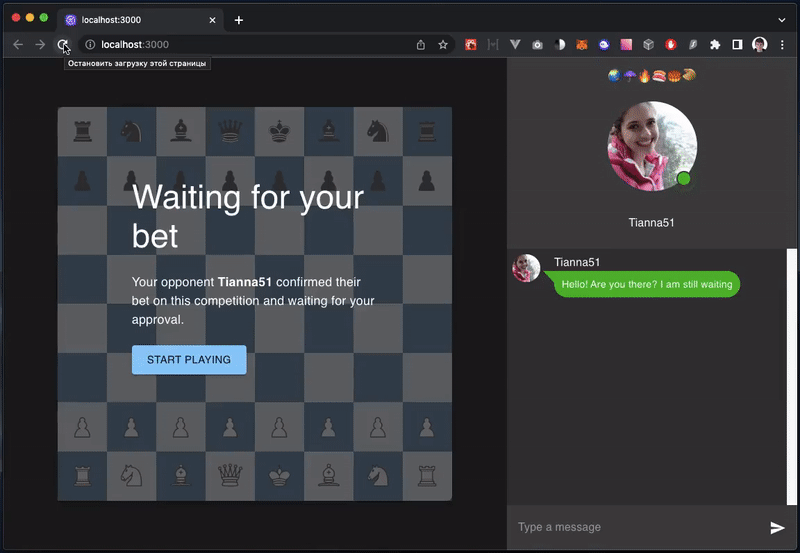

# chess-platform-concept

> dApp concept

## Idea

An idea is simple. We can combine an [AI Chat bot](https://github.com/axa-group/nlp.js/) with [AI Chess bot](https://www.chess.com/terms/alphazero-chess-engine) so the user won't guess about he is plaing with PC. We can accept bets but AI will always win because It faster and stronger in chess
